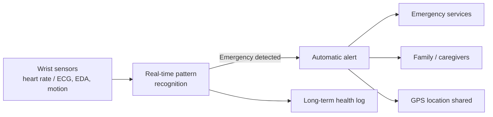

# Seizure & Stroke Alert Smartwatch

A concept for a smartwatch that detects seizures and strokes as they happen, then calls emergency services and shares the wearer's location automatically, with no action needed from the wearer or the people around them.

> **Status:** Idea / concept stage. Submitted to **AVISHKAR** (ISM Dhanbad). No hardware or code yet.

---

## The problem

A few months ago, someone in my family had a seizure for the first time. No one nearby knew how to respond or thought to call an ambulance. They recovered without lasting harm, but it showed how often this plays out: seizures and strokes come without warning, and most bystanders aren't trained to help.

- Seizures and strokes can happen to anyone, at any time. Causes include epilepsy, head injuries and other medical conditions.
- Low public awareness leaves bystanders unsure what to do, so help arrives late or the wrong thing gets done.
- Every minute counts, especially for people who live alone.

## The idea

A wrist-worn device keeps watching the wearer's vital signs. When it spots the pattern of a seizure or stroke, it raises the alarm by itself.

### Planned features

| Feature | What it does |
|---|---|
| Continuous monitoring | Tracks pulse and heart rhythm around the clock |
| Pattern recognition | Algorithms read the sensor data in real time to spot seizure or stroke patterns |
| Automatic alerts | Contacts emergency services without the wearer having to do anything |
| GPS location | Sends the wearer's exact location to first responders |
| Health data log | Stores long-term data to reveal triggers and risk patterns for doctors |
| Custom settings | Lets users set detection sensitivity and emergency contacts |
| Simple interface | Easy to use for both the wearer and their emergency contacts |
| Battery efficiency | Balances always-on monitoring with a full day of battery life |
| Privacy | Protects health data with strong security |

### Sensing approach

Wearable seizure-detection research uses several signals ([review](https://pmc.ncbi.nlm.nih.gov/articles/PMC8610510/)). This concept focuses on the ones a watch can capture:

- **Heart rate / ECG:** sudden changes in heart rhythm
- **Electrodermal activity (EDA):** skin-conductance spikes tied to seizures
- **Actigraphy / motion:** the rhythmic movement of convulsive seizures

EEG and EMG are the other main signals in the research, but they need electrodes on the body, so they're outside a watch-only design.

## Why a watch?

- **Always worn:** the wrist allows continuous monitoring wherever the wearer is, even far from medical help.
- **Non-intrusive:** no wires or electrodes, so people are more likely to wear it every day.
- **Real-time alerts** go to both the wearer and their caregivers.
- **Early intervention:** detecting an emergency quickly leads to better outcomes.
- **Useful data:** long-term records help doctors with diagnosis and treatment plans.

## Who it helps

- **People with epilepsy.** Epilepsy affects about 1% of people, and SUDEP (sudden unexpected death in epilepsy) is much more likely with frequent or night-time convulsive seizures.
- **Older adults** at risk of stroke.
- **People living alone** or in remote areas with limited healthcare access.
- **Families and caregivers,** who get peace of mind.
- **Research,** through anonymised data that helps us understand and prevent seizures and strokes.

## Open challenges

- **Detection accuracy:** catching real events while keeping false alarms low
- **Battery life:** always-on sensing in a watch-sized battery
- **Emergency integration:** reliably reaching ambulance and emergency services
- **Privacy and security:** handling sensitive health data
- **Sustainability:** recyclable materials, a repairable design and an e-waste take-back plan

## Reference

- [Seizure Detection Devices: Five New Things](https://pmc.ncbi.nlm.nih.gov/articles/PMC8610510/) (PubMed Central)

## Author

**Aarosh Karak**
